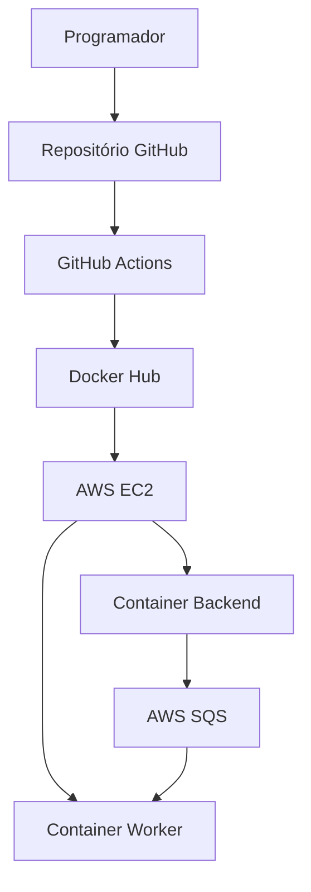

# Arquitetura

## Visão Geral

A solução foi desenvolvida na AWS utilizando Infraestrutura como Código (Terraform), Configuração Automatizada (Ansible), Contentorização (Docker) e Integração/Entrega Contínua (GitHub Actions).

## Diagrama da Arquitetura

## Componentes

### Infraestrutura AWS

* VPC
* Subnet Pública
* Internet Gateway
* Route Table
* Security Group
* Instância EC2
* IAM Role
* Fila SQS

### Backend

O Backend foi desenvolvido em Flask e disponibiliza endpoints HTTP.

Responsabilidades:

* Receber pedidos dos utilizadores
* Enviar mensagens para a AWS SQS
* Disponibilizar a API da aplicação

### Worker

O Worker executa em segundo plano e consome mensagens da fila SQS.

Responsabilidades:

* Ler mensagens da fila
* Processar tarefas assíncronas

### CI/CD

O GitHub Actions é responsável por:

* Construir as imagens Docker
* Publicar as imagens no Docker Hub

## Fluxo de Comunicação

1. O utilizador envia um pedido ao Backend
2. O Backend envia uma mensagem para a AWS SQS
3. O Worker consome a mensagem da fila
4. O Worker processa a tarefa
