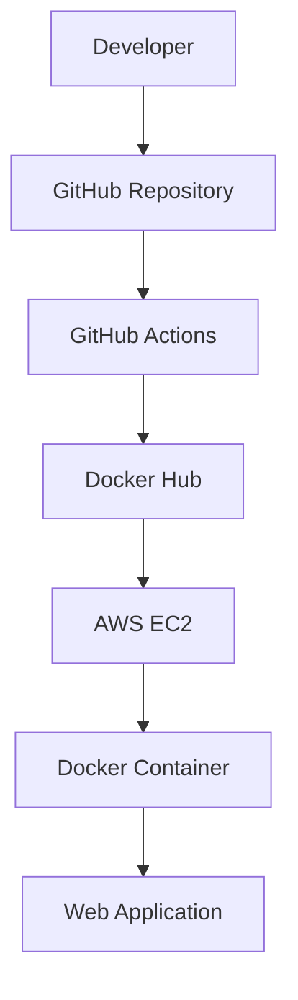

User
  |
Internet
  |
AWS EC2
  |
Docker Container (Nginx)
  |
Custom Web Application

```mermaid
flowchart TD

A[Developer]
--> B[GitHub Repository]

B --> C[GitHub Actions]

C --> D[Docker Hub]

D --> E[AWS EC2]

E --> F[Docker Container]

F --> G[Web Application]
```